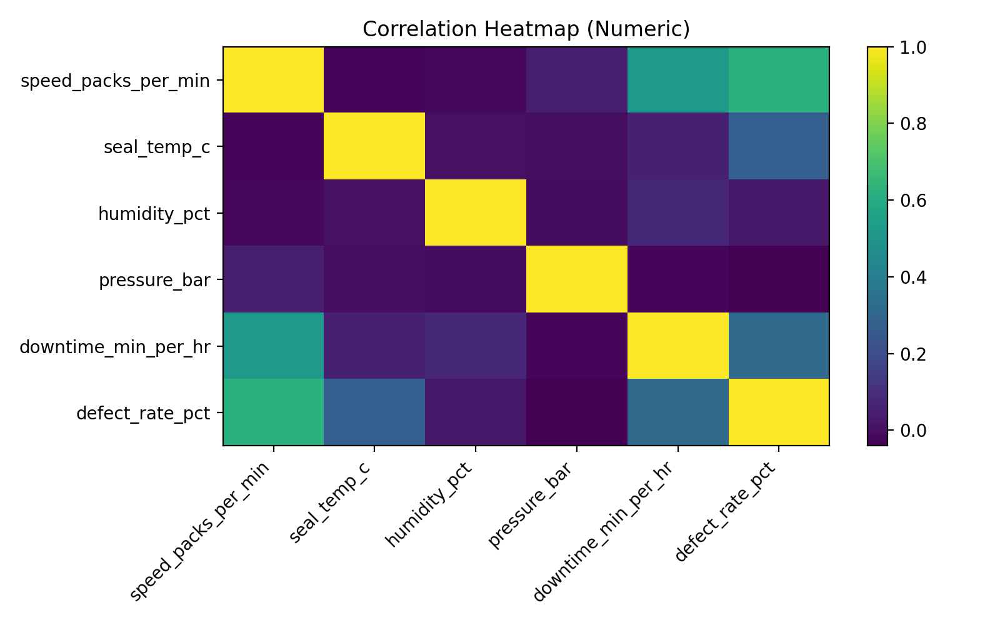

# Machine Learning-Based Process Optimization & Quality Improvement

## 📌 Project Overview

This project demonstrates a machine learning-based framework for manufacturing process optimization and quality improvement.

The objective is to analyze manufacturing process parameters, identify critical factors affecting defect rate, develop predictive models, and determine optimal operating conditions using data-driven approaches.

This project represents an Industry 4.0 approach by integrating industrial engineering principles with machine learning techniques.

---

# 🎯 Project Objectives

- Analyze manufacturing process data
- Establish baseline quality performance indicators
- Identify critical process parameters affecting defects
- Develop machine learning models for defect prediction
- Optimize operating parameter windows
- Generate data-driven engineering recommendations

---

# 🔄 Project Workflow

Process Data Collection
          |
          ↓
Data Cleaning & Preparation
          |
          ↓
Exploratory Data Analysis
          |
          ↓
Correlation Analysis
          |
          ↓
Machine Learning Model Development
          |
          ↓
Defect Rate Prediction
          |
          ↓
Optimization Simulation
          |
          ↓
Recommended Operating Conditions

# 📊 Dataset Description

The demonstration dataset contains simulated packing-line manufacturing data.

| Item | Description |
|---|---|
| Dataset Type | Simulated manufacturing process data |
| Number of observations | 240 |
| Target Variable | Defect Rate (%) |
| Application Area | Manufacturing Quality Improvement |

Process parameters analysed:

- Machine speed
- Seal temperature
- Humidity
- Pressure
- Downtime

---

# 🤖 Machine Learning Approach

Two regression models were developed:

## 1. Linear Regression

| Metric | Value |
|---|---|
| R² Score | 0.308 |
| RMSE | 0.449 |
| MAE | 0.361 |

## 2. Random Forest Regression

| Metric | Value |
|---|---|
| R² Score | 0.157 |
| RMSE | 0.496 |
| MAE | 0.380 |

Based on the demonstration dataset, Linear Regression showed better performance.

---

# 📈 Results & Analysis

## Correlation Analysis

Correlation analysis identified important relationships between process parameters and defect rate.

Line speed and downtime showed strong influence on defect variation.

---

# ⚙️ Process Optimization Result

The optimized operating window was obtained through simulation of multiple parameter combinations.

| Parameter | Recommended Range |
|---|---|
| Speed | 107.26 – 110.92 packs/min |
| Seal Temperature | 65.80 – 67.92 °C |
| Humidity | 47.39 – 61.33 % |
| Pressure | 4.02 – 4.47 bar |
| Downtime | 1.88 – 5.47 min/hr |

---

# 🛠️ Technology Stack

- Python
- Pandas
- NumPy
- Scikit-learn
- Matplotlib
- Jupyter Notebook
- Excel

---

# 📂 Repository Structure

---

# 📌 Key Outcomes

✔ Machine learning framework for defect prediction  
✔ Identification of critical process parameters  
✔ Data-driven optimization approach  
✔ Industrial quality improvement methodology  
